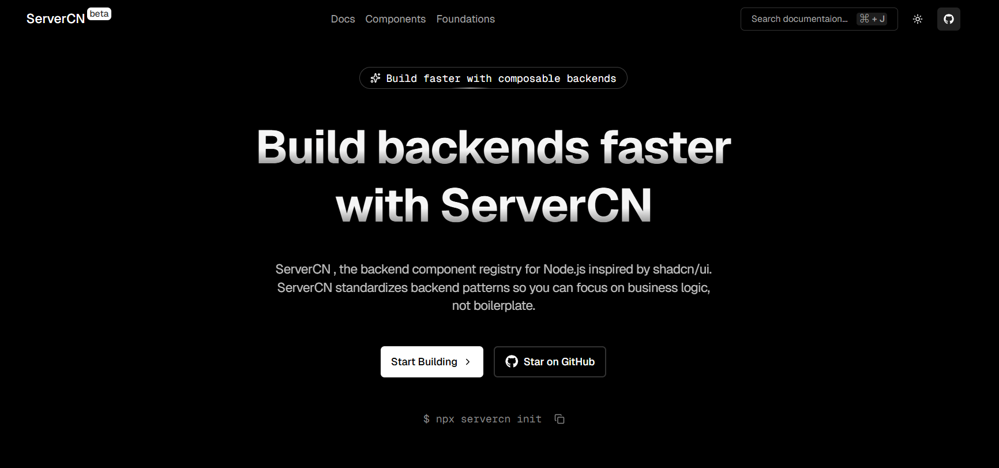

# ServerCN

> **Backend components CLI for Node.js & Typescript**


**ServerCN** is a backend component registry for Node.js & TypeScript. It provides a robust collection of pre-configured components, boilerplates, and utilities for **Node.js** and **TypeScript**, enabling developers to scaffold production-ready code in seconds.

The goal of servercn is similar to shadcn/ui for frontends: instead of hiding logic behind heavy abstractions, it gives you copy‑friendly, understandable, and extensible backend building blocks that you fully own.

---



## 🚀 Key Features

- **⚡ Instant Scaffolding**: Quickly generate backend components like Authentication, Logging, and Database setups.
- **🛡️ Type-Safety First**: Built entirely with TypeScript for robust and reliable code.
- **🔐 Secure by Design**: Includes best-practice implementations for security (Argon2, JWT, Zod).
- **🧩 Modular Architecture**: Add only what you need to your existing project.
- **📝 Comprehensive Logging**: Integrated with Pino and Winston for effective monitoring and debugging.

## 📦 Components

ServerCN allows you to quickly add the following components to your project:

- **Authentication System** (JWT, Refresh Tokens, Password Hashing)
- **Database Connection** (Mongoose/MongoDB)
- **Input Validation** (Zod)
- **Error Handling** (Global Error Handler, Async Wrapper)
- **Logging** (Winston, Pino)

## 🛠️ Usage

### 1. Initialize a Project

Start a new project with a recommended, production-ready structure.

```bash
npx servercn init
```

### 2. Add Components

Add specific modules to your existing project. This allows for incremental adoption.

```bash
servercn add [component-name]
```

Examples:

```bash
servercn add auth
servercn add logger
```

## Components

- ### API Error Handler

```bash
npx servercn add error-handler
```

- ### API Response Formatter

```bash
npx servercn add response-formatter
```

- ### Async Handler

```bash
npx servercn add async-handler
```

- ### File Upload Cloudinary

```bash
npx servercn add file-upload
```

- ### JWT Utils

```bash
npx servercn add jwt-utils
```

- ### Logger Pino

```bash
npx servercn add logger-pino
```

- ### Logger Winston

```bash
npx servercn add logger-winston
```

- ### Rate Limiter

```bash
npx servercn add rate-limiter
```

- ### Github OAuth

```bash
npx servercn add github-oauth
```

- ### Google OAuth

```bash
npx servercn add google-oauth
```

- ### Github and Google OAuth

```bash
npx servercn add github-google-oauth
```

- ### Health Check

```bash
npx servercn add health-check
```

### And more

### 3. List Components

View all available components that you can add to your project.

```bash
npx servercn list
```

## 🏗️ Project Structure

The generated code follows a clean, MVC-inspired architecture designed for scalability:

```bash
src/
├── config/         # Environment variables and configuration
├── controllers/    # Request handlers
├── middlewares/    # Express middlewares (Auth, Error handling)
├── models/         # Database models (Mongoose schemas)
├── routes/         # API routes definitions
├── services/       # Business logic layer
├── utils/          # Helper functions and classes
└── app.ts          # App entry point
└── server.ts       # Server entry point
```

## 💻 Tech Stack

- **Runtime**: Node.js
- **Language**: TypeScript
- **Framework**: Express.js
- **Frontend**: Next.js

## 🤝 Contributing

We welcome contributions! Please feel free to submit a Pull Request.

## 📄 License

This project is licensed under the [MIT License](LICENSE).

---

<p align="center">
  Built with 🗡️ by <a target="_blank" href="https://github.com/akkaldhami">Akkal Dhami</a>
</p>
