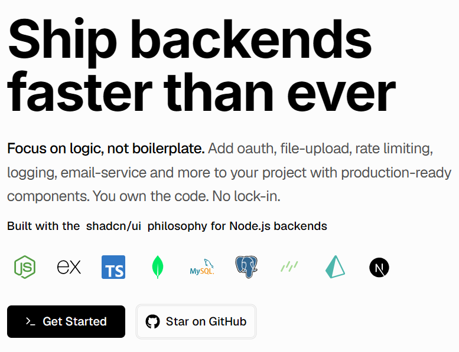

# servercn

> **Backend component registry for Node.js & TypeScript**


**servercn** is a backend component registry for Node.js & TypeScript. It provides a robust collection of pre-configured components, boilerplates, and utilities for **Node.js** and **TypeScript**, enabling developers to scaffold production-ready code in seconds.

> Shadcn ecosystem for Node.js backend



[Visit website](https://www.servercn.xyz)

[Join discord](https://discord.gg/2fXqnTXF8d)

## 🛠️ Usage

### 1. Initialize a Project

Start a new project with a recommended, production-ready structure.

```bash
npx servercn-cli init
```

### 2. Add Components

Add specific modules to your existing project. This allows for incremental adoption.

```bash
npx servercn-cli@latest add [component-name]
```

Examples:

```bash
npx servercn-cli@latest add logger
```

```bash
npx servercn-cli@latest add oauth
```

## 🤝 Contributing

We welcome contributions! Please feel free to submit a Pull Request.

[Contributing guides](https://servercn.vercel.app/contributing)

## 📄 License

This project is licensed under the [MIT License](LICENSE).

## Stargazers over time

[](https://repostars.dev/?repos=AkkalDhami%2Fservercn&theme=dark)

<p align="center">
  Built with 🪓 by <a target="_blank" href="https://github.com/akkaldhami">Akkal Dhami</a> and the <a target="_blank" href="https://servercn.vercel.app/contributors">servercn contributors</a>
</p>
